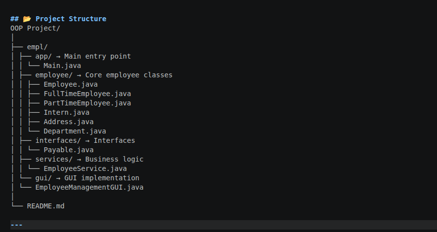

# 🧑‍💼 Employee Management System (Java OOP + GUI)

## 📌 Description

The Employee Management System is a Java-based application designed to efficiently manage employee records within an organization.

The system supports multiple types of employees, including:

- Full-Time Employees
- Part-Time Employees
- Interns

## It provides functionalities such as:

- Employee record management
- Salary calculation
- Displaying employee information

## ⚙️ Key Features
- Add and manage employee details
- Support for different employee types
- Salary computation based on employee type
- Search and display employee information
- User-friendly GUI interface (Java Swing)

## 🧠 OOP Concepts Used
- Encapsulation → Protecting employee data using private fields
- Inheritance → Creating subclasses like FullTimeEmployee, PartTimeEmployee, Intern
- Polymorphism → Different salary calculations for different employee types
- Abstraction → Abstract Employee class defining common structure
- Interface → Payable interface for salary-related behavior
- Aggregation → Employee has Address and Department
- Package Structure → Organized code into logical packages

## 📂 Project Structure(with image)

---

## ▶️ How to Run

### 🔹 Step 1: Navigate to source folder
- cd empl

 
# Step 2: Compile all Java files
- javac app/*.java employee/*.java interfaces/*.java services/*.java gui/*.java

# Step 3: Run the program
- java app.Main
